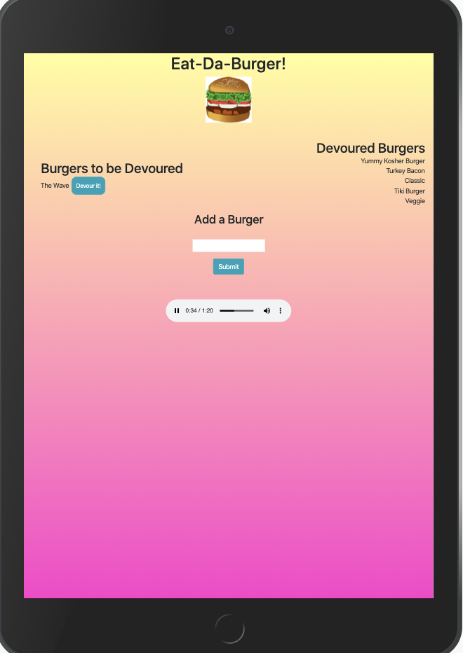

# burger

This is an app, titled: "Eat-Da-Burger!". It is a restaurant app that allows users to input names of burgers that they would like to eat. 

When users submit burger names, the app will display a burger on the *left* side of the page. 

Each burger in the waiting area has a *Devour It!* button. When the user clicks it, the burger will move to the *right* side of the page. 

The app will store every burger in a database, whether it was 'devoured' or not. 

Technologies Used: MySQL, Node, Express, Handlebars, Bootstrap 4, HTML5, CSS3, and a homemade ORM.

Song: "Burger Theme" by Melanie Rogoff.

**Deployed Link**: https://floating-gorge-77305.herokuapp.com/

Screenshot: 

